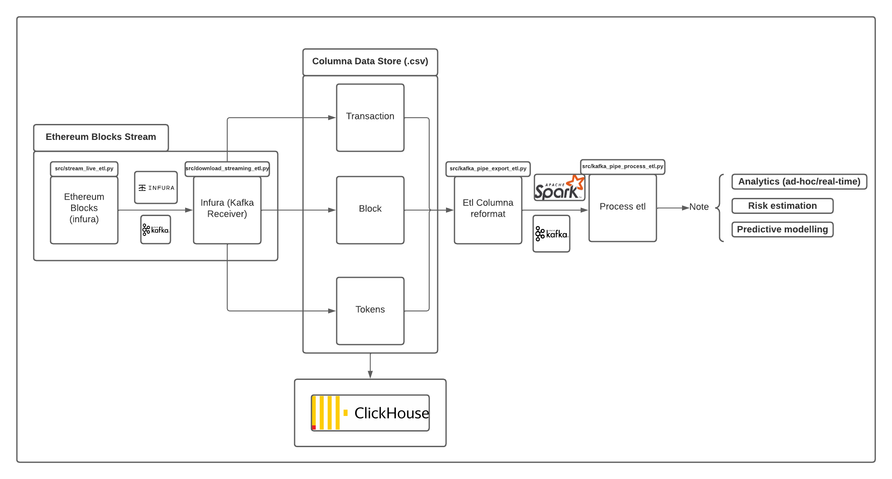

# Digital Assets analytics - Risk Estimation
digital-assets-etl-pipeline-analytics




# Problem

Can we estimate risk in our digital assets? Hence, can we have a data etl pipeline that helps us estimate this risk?

# Program breakdown

### Install requirements.txt

```
pip3 install -r requirements.txt
```

### Setup kafka and your custom .env file - following this guide

- *https://www.digitalocean.com/community/tutorials/how-to-install-apache-kafka-on-ubuntu-20-04*

- specify the following in you .env files
    - etl_bootstrap_server= #you can setup public kafka server on digital ocean
    - etl_producer=finance.etl_producer
    - etl_consumer=finance.etl_consumer
    - api_secret_key= # from infura
    - api_key= # from infura
    - project_id= # from infura
    - batch_size=200
    - consumer_etl_blocks=blocks
    - consumer_etl_transactions=transactions
    - consumer_etl_tokens=token_transfers


### Stream etl blocks from infura via kafka, into columna stores

```
python3 src/stream_live_etl.py # Stream blocks of data

python3 src/download_streaming_etl.py # downloads blocks into csv (columna format)

```

### reformat data and stream via apache spark & kafka for real-time etl analytics

```
python3 src/kafka_pipe_export_etl.py #streams .csv data of block, transaction and tokens for processing

python3 src/kafka_pipe_process_etl.py # consume streamed data and run's web3 analytics
```

### Analytical Schema 

```
data = {
    "transaction":  ['timestamp', 'number', 'hash', 'parent_hash', 'nonce', 'sha3_uncles', 'logs_bloom', 'state_root', 'receipts_root', 'miner', 'difficulty', 'total_difficulty', 'size', 'extra_data', 'gas_limit', 'gas_used', 'transaction_count'],
    
    "block":  ['transaction_index', 'from_address', 'hash', 'value', 'nonce', 'to_address', 'gas', 'gas_price', 'input', 'receipt_cumulative_gas_used', 'receipt_gas_used', 'receipt_contract_address', 'receipt_root', 'receipt_status', 'block_timestamp', 'block_number', 'block_hash', 'max_fee_per_gas', 'max_priority_fee_per_gas', 'transaction_type', 'receipt_effective_gas_price'],
    
    "tokens":  ['from_address', 'to_address', 'value', 'block_timestamp', 'block_number', 'block_hash']
}

```