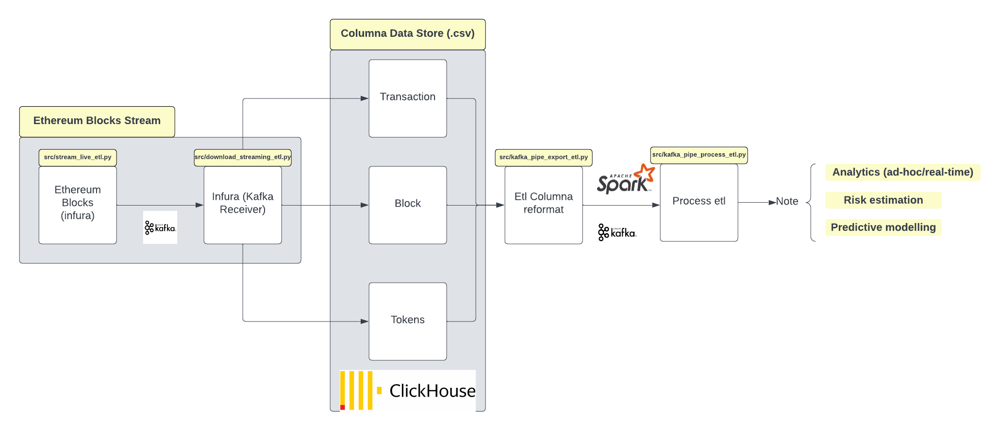

# ardu-finance-challenge
Ardu-digital-assets-challenge



# Problem

Can we estimate risk in our digital assets? Hence, can we have a data etl pipeline that helps us estimate this risk?

# Program breakdown

### Install requirements.txt

```
pip3 install -r requirements.txt
```

### Setup kafka - following this guide

- *https://www.digitalocean.com/community/tutorials/how-to-install-apache-kafka-on-ubuntu-20-04*

- specify the following in you .env files
    - etl_bootstrap_server= #you can setup public kafka server on digital ocean
    - etl_producer=finance.etl_producer
    - etl_consumer=ardu.finance.etl_consumer
    - api_secret_key= # from infura
    - api_key= # from infura
    - project_id= # from infura
    - batch_size=200
    - consumer_etl_blocks=blocks
    - consumer_etl_transactions=transactions
    - consumer_etl_tokens=token_transfers


### Stream etl blocks from infura via kafka, into columna stores

```
python3 src/stream_live_etl.py # Stream blocks of data

python3 src/download_streaming_etl.py # downloads blocks into csv (columna format)

```

### reformat data and stream via apache spark & kafka for real-time etl analytics

```
python3 src/kafka_pipe_export_etl.py #streams .csv data of block, transaction and tokens for processing

python3 src/kafka_pipe_process_etl.py # consume streamed data and run's web3 analytics
```